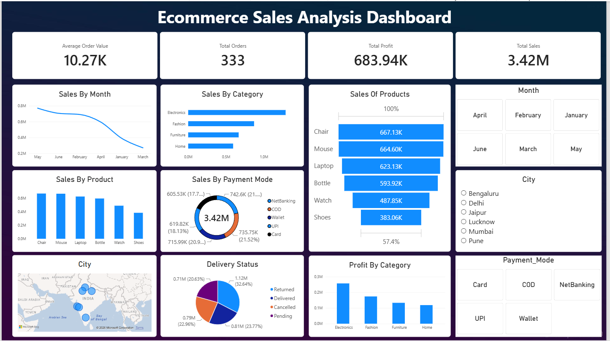

# E-commerce Sales Analysis

## About the Project

This project is based on an e-commerce sales dataset containing customer, order, product, payment, sales, and profit information.

I used Python, MySQL, Excel, and Power BI to clean the data, analyze sales performance, and create a dashboard that makes the results easier to understand.

## Tools Used

* Python (Pandas)
* MySQL
* Excel
* Power BI
* DAX

## What I Did

### Data Cleaning with Python

I used Pandas to prepare the dataset for analysis.

Some of the main cleaning steps were:

* Handled missing values
* Converted date columns into the correct format
* Filled missing discount values
* Handled missing phone and delivery date values
* Calculated the `Net_Amount`
* Prepared the cleaned data for further analysis

### SQL Analysis

After cleaning the data, I loaded it into MySQL and wrote queries to look at different parts of the business.

The analysis includes:

* Total sales and profit
* Sales by city and state
* Product and category performance
* Monthly sales trends
* Order status
* Payment methods
* Customer-level sales

### Power BI Dashboard

I used Power BI to turn the analysis into an interactive dashboard.

The dashboard covers:

* Total Sales
* Total Orders
* Total Profit
* Average Order Value
* Sales by City
* Sales by State
* Category and Product Performance
* Order Status
* Payment Mode

## Dashboard

## Dataset Columns

The dataset contains fields such as:

`Order_ID`, `Order_Date`, `Customer_Name`, `Email`, `Phone`, `City`, `State`, `Product`, `Category`, `Qty`, `Unit_Price`, `Discount`, `Payment_Mode`, `Order_Status`, `Delivery_Date`, `Sales`, `Net_Amount`, `Profit`, `Month`, `Year`, and `Weekday`.

## Project Files

* `ecommerce.ipynb` – Python data cleaning
* `ecommerce_sales_analysis.sql` – SQL queries
* `ecommerce.pbix` – Power BI dashboard
* `clean ecommerce.xlsx` – Cleaned dataset
* `1.png` – Dashboard screenshot

## Key Takeaway

This project helped me practice the complete data analysis process, starting with data cleaning and SQL analysis and ending with an interactive Power BI dashboard.

## Author

**Prince Bhowra**

Data Analyst | SQL | Python | Power BI | Excel
